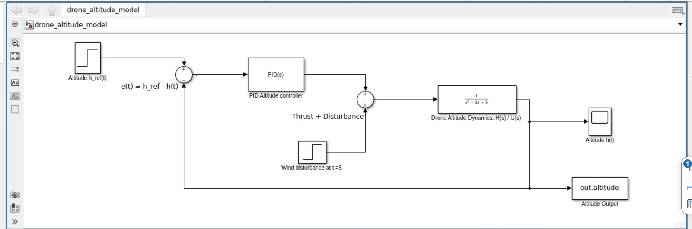
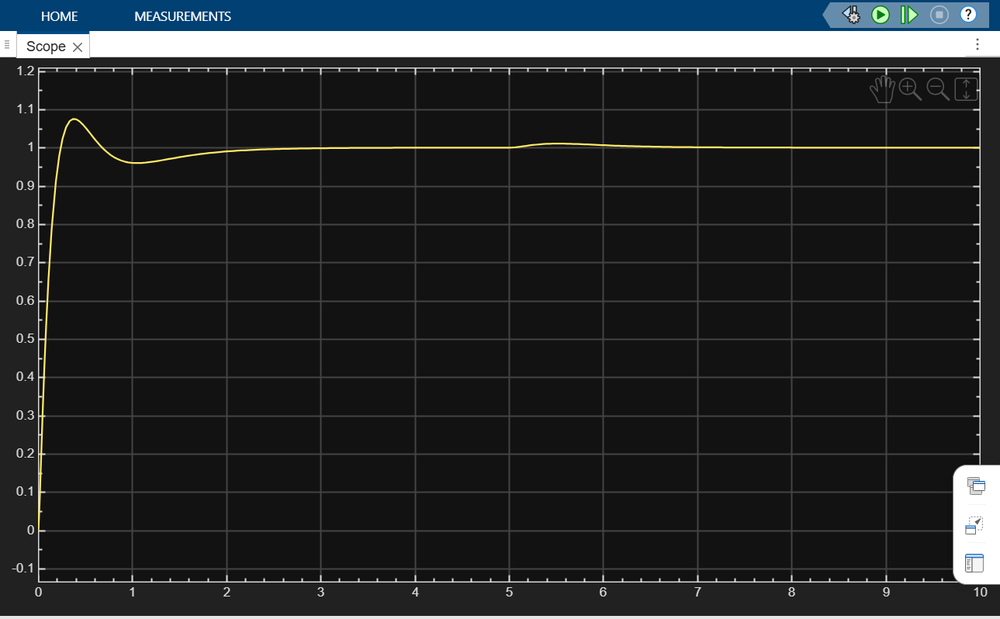
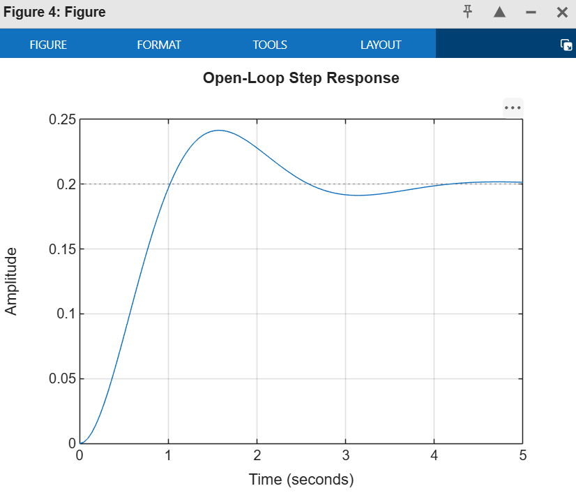
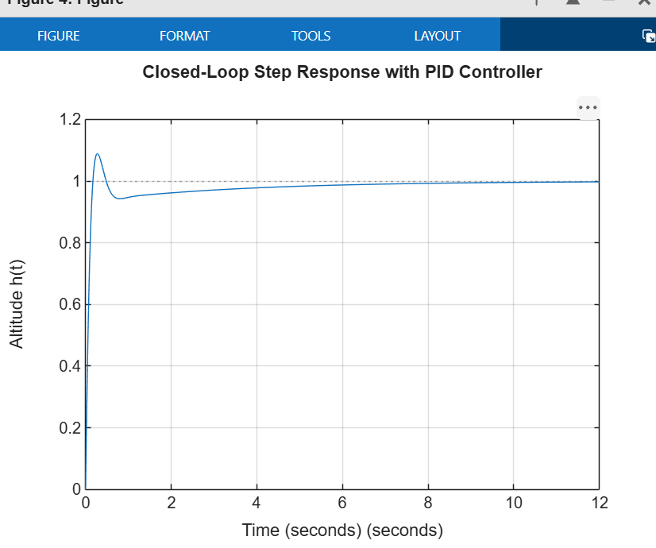
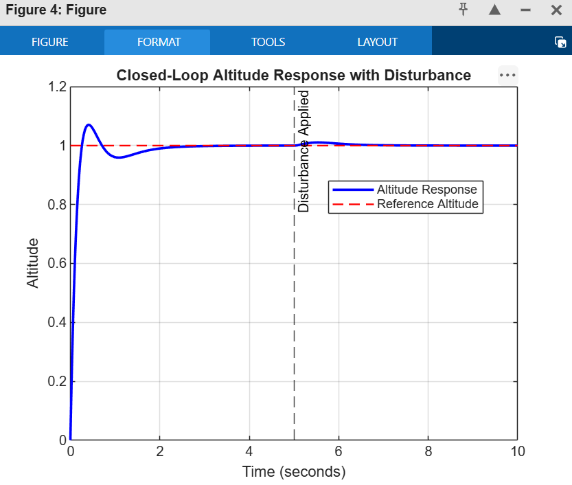

# Drone Altitude Stabilization Using PID Controller

## Project Overview
This project designs and simulates a PID control system to regulate the altitude of a drone under external disturbance such as wind.

The drone vertical dynamics are modeled using the transfer function:

G(s) = H(s)/U(s) = 1 / (s^2 + 2s + 5)

where:
- U(s) is the thrust command input
- H(s) is the altitude output

## Control Objective
The objective is to design a PID controller such that:
- Overshoot is less than 10%
- Settling time is less than 3 seconds
- Steady-state error is approximately zero
- System remains stable under disturbance

## Assumptions
- The drone altitude dynamics are approximated as a linear time-invariant second-order system.
- Input to the drone dynamics is thrust command.
- Output of the drone dynamics is altitude.
- Wind disturbance is modeled as an external input disturbance applied at t = 5 seconds.
- Sensor noise, actuator saturation, nonlinear aerodynamics, and battery effects are neglected.

## Dependencies
- MATLAB
- Simulink
- Control System Toolbox

## Repository Structure

Disha_mahale_Drone_Altitude_Stabilization/
## Repository Structure

| Folder/File | Description |
|---|---|
| `README.md` | Project explanation, dependencies, approach, results, and run instructions |
| `src/drone_altitude_pid.m` | MATLAB code for transfer function, PID controller, plots, and performance metrics |
| `src/drone_altitude_model.slx` | Simulink model for the closed-loop drone altitude control system |
| `results/simulink_model.png` | Screenshot of the Simulink model |
| `results/simulink_scope_output.png` | Scope output showing altitude response |
| `results/open_loop_response.png` | Open-loop response plot |
| `results/closed_loop_response.png` | Closed-loop response plot |
| `results/disturbance_response.png` | Disturbance response plot |
| `video/drone_altitude_working.mp4` | Working video of the simulation |

## Source Code
The src folder contains the MATLAB and Simulink source files:

- drone_altitude_pid.m  
  MATLAB script used to define the transfer function, design the PID controller, simulate the open-loop and closed-loop responses, introduce disturbance, and evaluate performance metrics.

- drone_altitude_model.slx  
  Simulink model file for the drone altitude control system. It contains the step reference input, PID controller, disturbance input, drone transfer function, feedback connection, scope, and altitude output.

## Approach
1. Define the drone altitude transfer function:

G(s) = 1 / (s^2 + 2s + 5)

2. Analyze the open-loop step response.
3. Design a PID controller.
4. Simulate the closed-loop response.
5. Add wind disturbance at t = 5 seconds.
6. Evaluate performance using standard control metrics:
   - Overshoot
   - Settling time
   - Steady-state error
   - Stability

## PID Controller Parameters

Kp = 70
Ki = 20
Kd = 11

## How It Works
The desired altitude is represented as h_ref(t) and the actual altitude output is represented as h(t).

The error signal is:

e(t) = h_ref(t) - h(t)

The PID controller uses this error to generate the thrust command. A wind disturbance is added at the plant input at t = 5 s. The drone plant then produces the altitude output h(t), which is fed back using negative feedback.

Desired Altitude -> Error Sum -> PID Controller -> Thrust + Wind Disturbance -> Drone Plant -> Altitude Output
                                      ^                                           |
                                      |___________________________________________|

## Simulink Model
The Simulink model implements the closed-loop altitude stabilization system.

## Scope Output
The scope output shows the altitude response of the drone. The response settles near the desired altitude and remains stable after the disturbance is applied.

## Open-Loop Response
The open-loop response shows the behavior of the drone plant without the PID controller.

## Closed-Loop Response
The closed-loop response shows the altitude response after applying the PID controller.

## Disturbance Response
A wind disturbance is applied at t = 5 s. The PID controller rejects the disturbance and brings the altitude back near the desired value.

## Results

| Metric | Requirement | Result |
|---|---:|---:|
| Overshoot | < 10% | Satisfied |
| Settling Time | < 3 s | Satisfied |
| Steady-State Error | Approximately 0 | Satisfied |
| Stability | Stable | Satisfied |
| Disturbance Rejection | Stable under disturbance | Satisfied |

## How to Run

1. Open MATLAB.
2. Open the src folder.
3. Run the MATLAB script:

drone_altitude_pid

4. To open the Simulink model, run:

open_system('drone_altitude_model')

5. Run the Simulink model and open the Scope block to view the altitude output.

## Working Video
The working simulation video is available here:

[Watch Working Video](video/drone_altitude_working.mp4)

The video demonstrates:
- MATLAB code execution
- Simulink model running
- Scope output response
- Disturbance rejection behavior

## Conclusion
The PID controller successfully stabilizes the drone altitude. The system satisfies the required design objectives: overshoot less than 10%, settling time less than 3 seconds, steady-state error approximately zero, and stable operation under wind disturbance.

